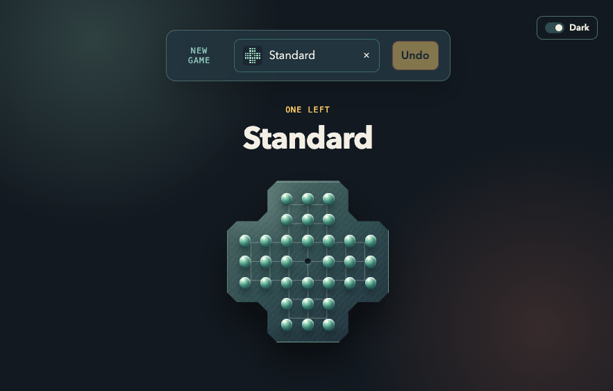
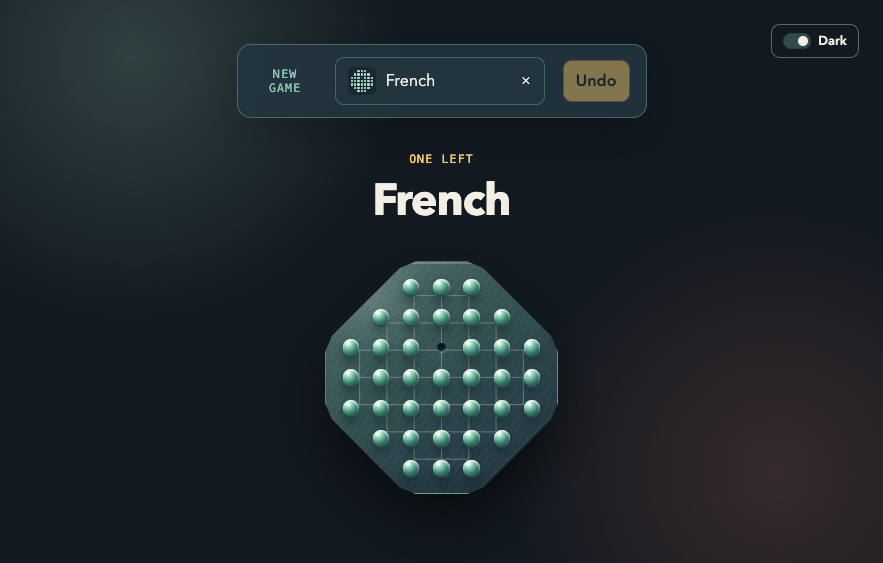
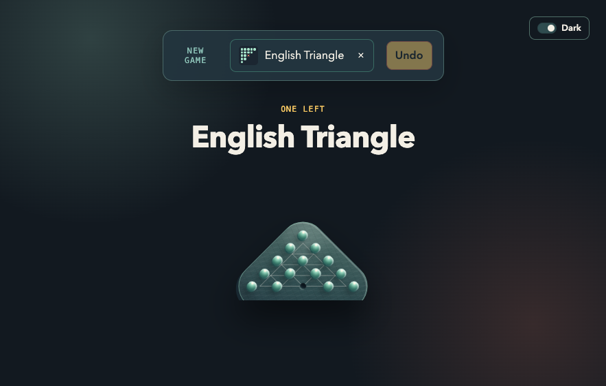
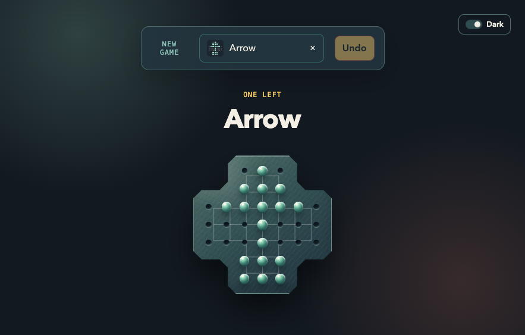
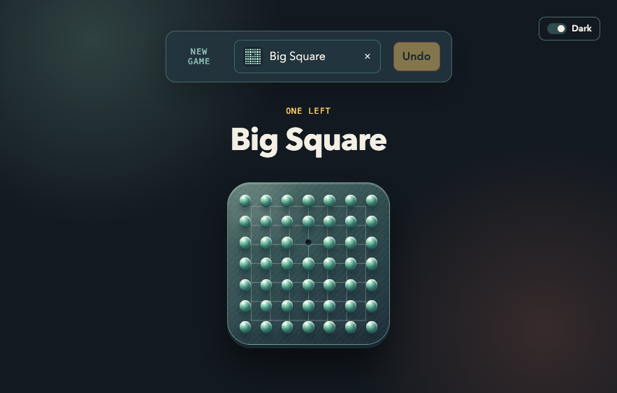

# One Left

A desktop version of the classic peg solitaire board game: remove pins by jumping over them until only one remains.

## Screenshots

Preview several of the available board modes:

| Standard | French |
| --- | --- |
|  |  |

| English Triangle | Arrow |
| --- | --- |
|  |  |

| Big Square |
| --- |
|  |

## Modern stack

- Electron with a secure preload boundary
- React and Vite
- Electron Builder for desktop packages
- Vitest smoke tests
- Node.js 22 LTS, including Intel macOS support

## Development

Install Node 22 with [nvm](https://github.com/nvm-sh/nvm):

```bash
nvm install
nvm use
```

Install dependencies and start the Vite development server with Electron:

```bash
npm ci
npm run dev
```

The production renderer can be built with:

```bash
npm run build
npm start
```

## Verification

```bash
npm run lint
npm test
npm run build
```

## Packaging

Build a package for the current platform:

```bash
npm run package
```

Platform-specific commands are also available:

```bash
npm run package-mac
npm run package-linux
npm run package-win
```

Build artifacts are written to `release/` and are excluded from Git.

## Gameplay

Choose a board from the selector. Select a pin, then select a valid hole to jump over an adjacent pin. The jumped pin is removed. The game ends when one pin remains or no legal move is available.

The repository contains classic boards including Standard, Cross, Plus, Bench, Arrow, Pyramid, Diamond, Big Square, French, and English Triangle.

## Project structure

```text
.
├── app/                 # React renderer and board data
├── electron/            # Electron main process and preload
├── index.html           # Vite renderer entry document
├── vite.config.js       # Renderer build configuration
├── eslint.config.js     # Modern ESLint configuration
├── test/                # Focused Vitest tests
└── package.json         # Scripts and dependencies
```

## GitHub Actions

Pull requests and pushes to `main` or `modernize-electron-react` run dependency installation, linting, tests, and a production renderer build on Node 22.
